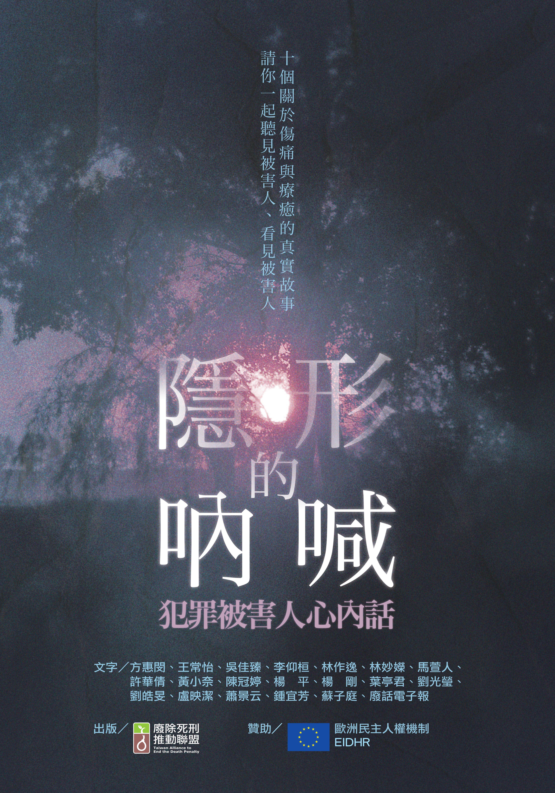

# 隱形的吶喊──犯罪被害人心內話

**一起看見被害人**

**文．吳佳臻 「台灣廢除死刑推動聯盟」副執行長**

這是一本談被害人的書，由「惡名昭彰」的「台灣廢除死刑推動聯盟」企劃、出版，許多人大概會覺得錯愕，「廢死聯盟也關心被害人？啐！」就是因為這樣，難道你不想知道為什麼？想知道邪惡團體到底安的什麼心？

「廢除死刑？如果你的家人被殺害了，你還支持廢除死刑嗎？」這是廢除死刑支持者經常要面臨的提問，這樣的提問是可以理解的，因為重大的犯罪事件可能造成有人重傷或死亡，而失去親人的痛苦往往是最難平復、最過不去的關卡，無論是誰。就算傷害並非發生在自己身上，目睹他人遭受痛苦而同感恐懼或悲憤亦是人之常情。

然而，充滿正義感和同理心的提問者通常預設「等你有親人被殺害，才有資格談廢死」，以及「犯罪被害人家屬一定會／要支持死刑」，似乎只有判死刑才能還被害人家屬公道，且只有執行死刑，犯罪被害人才能「了結」、才能「放下」。因著這樣的預設，經常，反對死刑制度的人就很容易被視為與被害人對立。但是對於廢死聯盟來說，「死刑存廢」與「被害人保護」並非互斥的兩件事情，如果「廢除死刑＝不保護被害人」，那麼，現在台灣仍有死刑，就表示被害人保護工作做得很好了？被害人的正義獲得伸張了？換句話說，相信「死刑可以保護被害人、給被害人公道」，可能過度樂觀且罔顧事實。

被害人保護是另一個專業領域，資源有限的廢死團體無法越俎代庖，取代國家照顧被害人的責任。無論如何，廢死聯盟從二〇〇三年成立以來，到二〇〇七年開始有全職的工作人員，我們就開始思考「被害人工作小組」的可能性。這樣的夢想一直到最近幾年，才有些小小的開展。和一些犯罪被害人家屬、心理師的接觸之後，我們決定試著從了解被害人的聲音與需求開始，了解目前犯罪被害保護制度的實際運作，在推進廢死運動時同時也幫被害人發點聲音，為犯罪被害保護制度盡點微薄力量，因此才有本書的發想。

經過我們的拜訪，我們初步了解了台灣有保護犯罪被害人的專法《犯罪被害人保護法》，以及全台各縣市皆有「犯罪被害人保護協會」（簡稱「犯保協會」）之分會，提供犯罪被害人經濟、法律、心理、醫療等各方面的協助。不過，犯保協會受法務部保護司指揮、預算從中央編列，每個分會要承受數百件服務個案，只靠二到四名專職人員，經費和人力不足的話要自己憑本事募款、聘請專案人員或志工，心理諮商和法律或各項專案工作也要想辦法連結資源。雖然是官方設立的機構，但其中的辛苦與壓力，可不是一般人可以想像。

接著，我們也嘗試認識被害者家屬，這是一段充滿感激與感動的過程。願意接受我們採訪的被害者家屬，需要有點勇氣，因此，當他們願意向我們重述他們的傷痛，我們只能表達無盡的感激，並且不能辜負他們的期待──將被害者的聲音忠實傳達。有的家屬對於司法制度無法理解也無法諒解，認為法律總是站在加害者那一方，保障加害者權利，卻不聽被害者的聲音。

的確，《刑事訴訟法》原本是為了避免國家在起訴和審判人民的過程，誤傷了人民的權利（輕則冤獄，重則喪命），因此不能不小心，必須謹守程序和各項原則，在被宣判有罪之前要堅守無罪推定原則、要有足夠證據才能判刑、要給予聘請律師辯護的權利。然而，這樣的程序正義機制在被害者看來，卻是處處為加害者著想的設計。這樣的訴訟制度設計並非台灣獨創，如何在司法程序當中納入被害者的聲音，但同時兼顧被告的司法權利，值得我們進一步思考與研究。

此外，我們在採訪時發現，有些被害人家屬為領取被害補償金感到不好意思，有的人感念於已經受到太多幫助而不願再提出要求，有的人覺得被害人的身份讓他們難以融入社會……。其實更多的被害者家屬是不想去回顧案件、也不想跟加害者再有牽連，回想起任何細節都是讓人不忍的，他們只想好好地過活，為眼下生活打拚。遭逢重大創傷的心，是不可能有痊癒的一天，那傷痛永遠會存在，如同逝去的親人永遠不會回來。因此，只能把眼光放遠，咬緊牙，努力讓自己活著。

我們非常感謝接受我們採訪的朋友，無論是被害者家屬或者加害者家屬，願意如此無私地分享他們的傷痛和經歷。我們期待社會能夠看見他們、聽見他們。我們也期待透過這本冊子的小小努力，可以鼓勵更多被害者家屬和親友，也讓我們得以見到：被害者不是只能當被動的受助者，他們也能展現主體性，為自己說話。期待眾人能將「被害」視為社會應該共同承擔的結果，而非由倒楣的個人自己受苦。期待我們的犯罪被害人保護制度能有朝一日拋去「施捨」的態度，將被害人保護與支持，視為國家的義務與責任。

在此，我們先放下死刑存廢的爭辯，將目光聚焦在被害人權益。本書的受訪者不需要認同我們廢除死刑的立場，而除了犯罪案件的直接受害者家屬，我們也訪問了被告的家屬。無論是被害者或加害者家屬，在我們看來，他們都是無辜的第三方，他們的心聲與經歷都同等重要。我們期待，這本小冊子能夠讓有意願了解被害人保護工作的讀者，對這一議題有些初步認識，並且對不同樣貌與需求的被／加害人家屬有所理解，不要再將他們視為面目模糊且只有單一需要的一群人。

而國家的責任，不只在於事後的支持系統，還應包括預防犯罪和減少被害人，因此，社會安全網的建立才是更重要的當務之急。期待我們的被害人保護制度可以從人權的角度出發，看見每個人的需求，聽見每個聲音，細心觀照每個受傷的心。

本書的出版，對廢死聯盟來說只是一個開始，後續要做什麼？能做什麼？取決於有多少人願意一起看見被害人，參與被害人運動。甚至能否有合適的人、合適的團體繼續往下做得更深、更好？我們深深地期待。

### 感謝名單（依筆劃排列）：

犯罪被害人保護協會（台中分會、台南分會、南投分會、新北分會、士林分會、高雄分會、台東分會）、歐洲經貿辦事處、法國在台協會、伍治中、呂秀梅、李家驊、林坤賢、林美秀、張秀珠、陳歆怡、陳靜如、柳颯颯、顧玉珍

### 贊助：

* 歐洲民主人權機制（European Instrument for Democracy and
Human rights, EIDHR）
* 開放社會基金會

### 「看見被害人」被害人工作小組簡介

「台灣廢除死刑推動聯盟」於­二〇〇四年初識美國「謀殺被害者家屬人權促進會」（Murder Victims' Families for Human Rights, MVFHR），從全新的角度認識被害人權利議題，二〇〇五年起陸續邀請該團體成員來台分享。二〇〇七年廢死聯盟組成「被害人工作小組」，持續舉辦相關主題座談與研討會，並陸續召募成員，小組成員包括被害者家屬、社工、心理諮商專業人士、律師、人權工作者等。

被害人工作小組沒有足夠的資源進行個案服務，但是我們希望透過各種方式理解被害人議題，並且嘗試推動相關制度的改善。我們的工作包括：舉辦內部培訓工作坊、拜訪被害者家屬、舉辦公開論壇、放映被害人主題影片、與相關單位交流（例如犯罪被害人保護協會、法務部保護司、歐洲駐台各辦事處等）。被害人工作小組的目標在於：瞭解犯保實務工作與困境，建立被害人權利保護的資訊平台，以被害人工作小組的名義協助從制度上進行監督和促成改變、進而協助被害人成立以犯罪被害人為主體的專業團體。

更多資訊，請參考[「看見被害人」臉書專頁](https://www.facebook.com/shinealightonvictims/)

### 台灣廢除死刑推動聯盟簡介

廢死聯盟於二〇〇三年成立，希望有一天台灣能夠成為一個沒有死刑的國家。我們知道這是一個漫長的對話及理解的過程，因此廢死聯盟的工作重點放在深度對話。我們舉辦各種公開活動和社會大眾對話；以教育教材工作坊和老師對話；以本土研究、民意調查跟政治人物對話；以專業訓練課程和法律人對話。2018年，我們將透過公民審議會議，與台灣各地民眾針對死刑的替代方案進行討論。

我們認為死刑是否存廢，都不能忽視犯罪被害人的權利，僅以死刑作為補償被害人的手段，是過於廉價的正義，同時忽視社會整體與國家的責任。當一個社會無法讓每個人安居樂業，犯罪就會發生，每個人都有可能是犯罪被害人，因此，我們希望透過瞭解、溝通，聽見被害人的聲音，盡我們的能力，為共同促進更完善的犯罪被害人支持體系而努力。

欲瞭解更多，歡迎參閱[廢死聯盟網站](http://www.taedp.org.tw)

欲掌握廢死聯盟的最新動態，歡迎訂閱「廢話電子報」或關注]「TAEDP FORUM廢死論壇」臉書專頁](https://www.facebook.com/taedpforum/)

### 相關資訊

* 企劃：「看見被害人」被害人工作小組
* 文字：方惠閔、王常怡、吳佳臻、李仰桓、林作逸、林妙嬫、馬萱人、許華倩、黃小奈、陳冠婷、楊平、楊剛、葉亭君、劉光瑩、劉皓旻、盧怡潔、蕭景云、鍾宜芳、蘇子庭、廢話電子報（依姓氏筆劃排列）
* 美術設計／編輯：Ozzy Chen
* 校對：吳佳珮、吳佳臻、林欣怡、林慈偉、馬萱人
* 主編：吳佳臻、馬萱人
* 發行人：李茂生
* 出版：台灣廢除死刑推動聯盟
* 地址：台北市100北平東路7──4號2樓
* 電話：（02）23951158
* 傳真：（02）23951139
* Email：taedp.tw@gmail.com
* 網址：http://taedp.org.tw
* ISBN: 9789868530546
